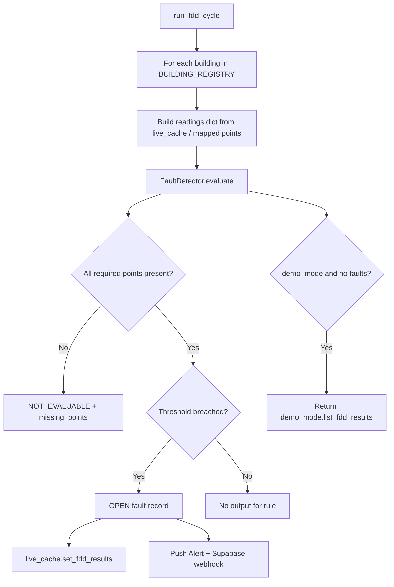

# FDD Rules Engine

**Last updated:** 2026-08-29  
Fault detection and diagnostics — rule engine, prerequisites, and `NOT_EVALUABLE` handling.

## Components

| Piece | Path |
|-------|------|
| Rule definitions | `app/ml/fault_detector.py` → `FDD_RULES` |
| Evaluator | `FaultDetector.evaluate()` |
| Pipeline job | `app/services/pipeline.py` → `run_fdd_cycle` (60s) |
| API | `GET /api/v1/alerts/fdd` (`app/api/alerts.py`) |
| Cache | `app/services/live_cache.py` |
| Frontend | `buildopt-ai` `/fdd` → `useFddResults` hook |
| Demo results | `app/services/demo_mode.py` → `list_fdd_results()` |

## Rule catalog (current)

7 rules implemented in code (site metadata claims 50 — aspirational in `app/api/site.py`):

| Rule ID | Category | Check | Threshold | Requires points |
|---------|----------|-------|-----------|-----------------|
| FDD-001 | HVAC | `supply_air_temp_deviation` | 2.0 | `supply_air_temp_deviation` |
| FDD-007 | Chiller | `cop_degradation` | COP < 3.0 | `cop` |
| FDD-011 | AHU | `filter_pressure_drop` | > 250 Pa | `filter_pressure_pa` |
| FDD-016 | BMS | `stuck_sensor` | variance == 0 | `sensor_variance` |
| FDD-019 | Energy | `baseline_deviation` | > 15% | `baseline_deviation_pct` |
| FDD-022 | Refrigeration | `high_superheat` | > 10 K | `superheat_k` |
| FDD-025 | Refrigeration | `nh3_leak` | > 25 ppm | `nh3_ppm` |

Checker lambdas: `RULE_CHECKS` dict in `fault_detector.py`.

## Evaluation flow



## Prerequisites

Each rule declares `requires: [point_keys]`. Evaluation:

```python
if not all(key in present for key in required):
    not_evaluable.append({
        "rule_id": rule["id"],
        "status": "NOT_EVALUABLE",
        "missing_points": [...]
    })
```

### Resolving prerequisites

1. Map logical keys via `metasys_auto_mapper` (see `docs/point-mapping.md`).
2. Ensure poll cycle writes derived metrics (e.g. `supply_air_temp_deviation`) — **PARTIAL**; many derived points not yet computed in `live_data_service`.
3. Energy rule FDD-019 needs **2-week baseline** (`PRODUCTION.md` § baseline).

## NOT_EVALUABLE semantics

| Status | Meaning | UI behavior |
|--------|---------|-------------|
| `NOT_EVALUABLE` | Required telemetry missing or unmapped | Show "insufficient data" — **not** a fault |
| `OPEN` | Threshold breached | Alert card, severity `warning` |
| Demo faults | Seeded when `demo_mode=True` and no real faults | Demo badge required |

**Live mode rule:** Do not substitute demo faults when `NOT_EVALUABLE` — return explicit status only.

Return logic (`evaluate()`):

- If `demo_mode` and no faults → demo results (sales only).
- If `not_evaluable` and no faults → return `not_evaluable` list.
- Otherwise return fault list.

## Pipeline integration

`run_fdd_cycle`:

1. Reads building readings from cache/demo.
2. Instantiates `FaultDetector(demo_mode=settings.demo_mode)`.
3. Dedupes faults by `rule_id` + `equipment_id`.
4. Creates `Alert` objects → `live_cache` + optional Supabase webhook (`SUPABASE_ALERT_WEBHOOK_URL`).

Tracked in health UI: `GET /api/v1/health/pipeline` → job `fdd_engine`.

## API response shape

`FDDResult` schema: `app/models/schemas.py`

Fields: `rule_id`, `category`, `description`, `description_ar`, `severity`, `confidence`, `detected_at`, `status`, `equipment_id`.

## Tests

| Test | File |
|------|------|
| Rule fires on threshold | `tests/test_ml.py` |
| Module API includes FDD | `tests/test_modules_sessions.py` |
| Live empty (no demo) | `tests/test_data_integrity.py` |

## Gaps / roadmap

- [ ] Expand to full 26+ rule set referenced in audit
- [ ] Compute derived points (COP, baseline deviation) in poll cycle
- [ ] Surface `NOT_EVALUABLE` in frontend FDDEngine with missing-point list
- [ ] Disable demo fault injection when any building is `ACTIVE` live
- [ ] Version rules per building type (office vs cold storage)

## Related

- `docs/point-mapping.md`
- `docs/module-data-source-matrix.md` — `/fdd` row
- `BACKEND_COORDINATION.md` — alert webhook
