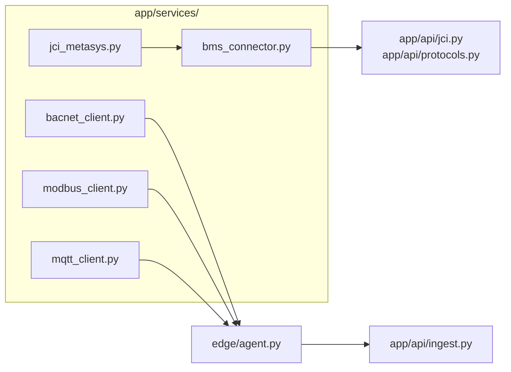

# Integration Architecture

**Last updated:** 2026-08-29  
BMS adapters, edge gateway, and network tunnel patterns for BuildOpt.

## Adapter overview



| Protocol | Implementation | Where it runs | Status |
|----------|----------------|---------------|--------|
| **JCI Metasys REST v4** | `JCIMetasysClient` in `app/services/jci_metasys.py` | Railway (cloud HTTPS) | PARTIAL — real login/read; demo token when `DEMO_MODE=true` |
| **BACnet/IP** | `app/services/bacnet_client.py` + `edge/agent.py` | On-prem edge only | PLACEHOLDER — BAC0 in full `requirements.txt`, not Railway image |
| **Modbus TCP** | `app/services/modbus_client.py` | On-prem edge | PLACEHOLDER — demo reads |
| **MQTT** | `app/services/mqtt_client.py` | On-prem edge | PLACEHOLDER |
| **OPC-UA** | — | — | MISSING |
| **Excel/CSV import** | `app/services/excel_import.py` | Railway upload | PARTIAL — needs `openpyxl` in prod image |

## BMS connector interface

`app/services/bms_connector.py` defines the target abstraction:

| Method | Purpose |
|--------|---------|
| `test_connection()` | Health probe |
| `discover_points()` | Object/point enumeration |
| `read_points(ids)` | Present-value batch read |
| `read_alarms()` | Active alarms |
| `write_point(id, value)` | Gated — returns `write_disabled` unless `allowed=True` |

`MetasysConnector` wraps `JCIMetasysClient` today. BACnet/Modbus should implement the same interface behind the edge agent.

## Metasys connection lifecycle

1. **Test** — `POST /api/v1/jci/test-connection` (always live probe, `demo_mode=False`)
2. **Save** — `POST /api/v1/jci/save-credentials` → `connection_store` + Supabase `building_connections` (`supabase/migrations/002_bms_connections.sql`)
3. **Auto-connect** — `POST /api/v1/jci/auto-connect` → discover objects, fuzzy map, poll (`app/services/bms_auto_connect.py`)
4. **Keepalive** — `pipeline.run_metasys_keepalive` every 10 min
5. **Poll** — `pipeline.run_poll_cycle` reads mapped present values → `live_cache` + InfluxDB

Credentials: per-building in Supabase preferred; fallback env vars `JCI_METASYS_*` in `railway.env.template`.

## Edge gateway

Deploy on building LAN when Metasys REST is unavailable or for BACnet/Modbus-only sites.

| Asset | Path |
|-------|------|
| Agent | `edge/agent.py` |
| BACnet map | `edge/bacnet_points.json` |
| Docker | `edge/docker-compose.yml` (`--profile edge-agent-bacnet`) |
| Docs | `edge/DEPLOY.md`, `edge/README.md` |

### Edge → cloud contract

| Endpoint | Auth | Purpose |
|----------|------|---------|
| `POST /api/v1/ingest/live` | `X-Ingest-Key: INGEST_API_KEY` | Point batch upload |
| `POST /api/v1/ingest/heartbeat` | Same | Liveness for `edge_heartbeat_store` |
| `GET /api/v1/ingest/status` | Public | Edge queue diagnostics |

Local queue: `EDGE_QUEUE_DB` (SQLite) with `INGEST_MAX_RETRIES`.

## Cloudflare Tunnel / VPN hooks

Metasys is often on private `192.168.x.x`. Railway cannot reach it without a tunnel.

| Option | Documented in | Automation |
|--------|---------------|------------|
| **Cloudflare Tunnel** | `PRODUCTION.md` § Phase 1, `LOVABLE_CONNECT.md` | Manual — expose Metasys HTTPS to `JCI_METASYS_HOST` |
| **Tailscale / site VPN** | `PRODUCTION.md` | Manual |
| **ngrok (dev only)** | `LOVABLE_CONNECT.md` | Dev smoke test |

**Target pattern:**

```
Metasys (LAN) → cloudflared / tailscale → public HTTPS URL → Railway JCI_METASYS_HOST
```

Firewall: allowlist Railway egress IPs on Metasys `POST /api/v4/login`.

## Protocol health surface

`GET /api/v1/health/protocols` aggregates:

- Metasys probe (`health_probe`)
- InfluxDB connectivity
- Supabase ping
- Edge heartbeat recency (`app/services/edge_heartbeat_store.py`)

Frontend: `src/pages/DataHealth.tsx`, `src/pages/SystemStatus.tsx`.

## Refrigeration / industrial

Separate auto-mapper: `app/services/refrigeration_auto_mapper.py`  
Static maps: `app/data/refrigeration_bacnet_map.json`, `refrigeration_modbus_map.json`  
API: `app/api/refrigeration.py`

## Alert sync path

```
FDD pipeline → Supabase webhook → supabase/functions/sync-bms-alert/ → building_alerts table
```

See `frontend-integration/LOVABLE_SUPABASE_EDGE.md` and `BACKEND_COORDINATION.md`.

## Related docs

- `docs/metasys-integration.md` — REST endpoints and test plan
- `docs/point-mapping.md` — canonical keys and fuzzy import
- `docs/railway-deployment.md` — env vars and healthcheck
