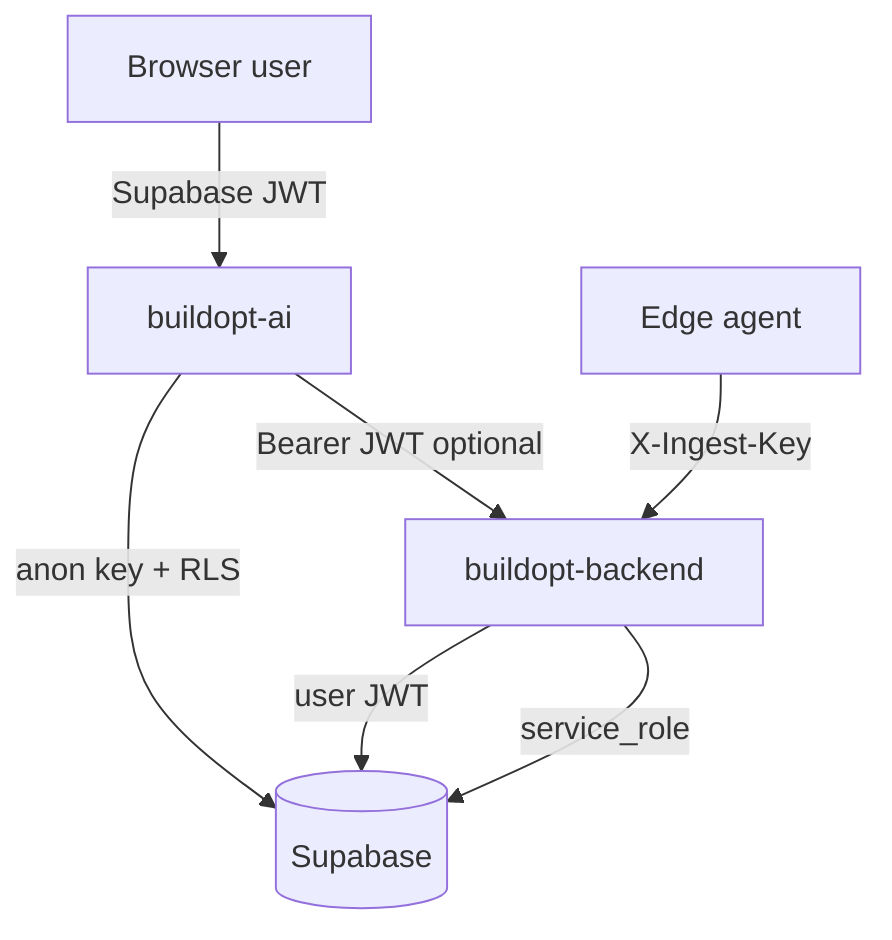

# Security Model

**Last updated:** 2026-08-29  
RBAC, Supabase RLS, API guards, and write-back gates.

## Trust boundaries

## Authentication

| Layer | Implementation | Path |
|-------|----------------|------|
| Identity provider | Supabase Auth (email+password, Google OAuth) | `buildopt-ai/src/hooks/useAuth.tsx` |
| JWT validation | Bearer token → `UserContext` | `app/deps/auth.py` |
| Optional vs required | `get_optional_user` / `get_required_user` | Per-route Depends |
| Demo quick-login | `useDemoAuth` | Disabled when `VITE_DEMO_MODE=false` |

**Rule:** No `localStorage` for role checks (project `.cursorrules`).

## RBAC — frontend

Roles stored in **`user_roles`** table (not on `profiles`). Loaded via `get_user_roles` RPC.

`buildopt-ai/src/hooks/useAuth.tsx` → `roleConfig`:

| Role | Module access |
|------|---------------|
| `facility_manager` | Operations, FDD, equipment, alerts, … |
| `energy_engineer` | Energy, optimization, predictive, … |
| `bms_integrator` | Integration, commissioning, edge-fleet, … |
| `admin`, `c_suite` | `modules: ['all']` |
| `tenant`, `cfo`, `maintenance_tech`, … | Scoped lists |

**Gap:** UI route hiding only — backend must mirror entitlements.

## RBAC — backend

| Mechanism | Path | Status |
|-----------|------|--------|
| `UserContext` | `app/models/user_context.py` | `account_mode`, `enabled_modules`, `building_ids`, `is_admin`, `is_read_only` |
| Module guard | `require_module_enabled(slug)` | `app/deps/guards.py` — live accounts need module in entitlements |
| Admin guard | `require_admin` | Admin routes |
| Write guard | `require_write_access` | Blocks read-only accounts |
| Building scope | `assert_building_access(user, building_id)` | Tenant building isolation |

### Module entitlements

Backend allowlist seed: `app/services/account_service.py`  
Supabase: `client_feature_modules` (frontend migrations)

## Supabase RLS

Canonical policies: `buildopt-ai/supabase/migrations/*.sql`

| Table | Policy intent |
|-------|---------------|
| `profiles` | User reads own profile |
| `user_roles` | `has_role()` SECURITY DEFINER function |
| `buildings` | Org-scoped CRUD |
| `building_points`, `building_connections` | Building owner access |
| `building_alerts` | Building-scoped read |

Backend repo mirror: `buildopt-backend/supabase/migrations/` (4 files — **drift risk** vs frontend 17 migrations).

**Action:** Treat `buildopt-ai/supabase/migrations` as canonical; sync backend copies.

## API route auth coverage

| Route group | Auth | Notes |
|-------------|------|-------|
| `/health/*` | Public | No secrets in response |
| `/ingest/*` | `INGEST_API_KEY` header | Not user JWT |
| `/jci/test-connection` | Public | **Risk** — rate limit TBD |
| `/modules/*` | Optional → module guard for live | Demo allows anonymous |
| `/buildings/*` | Partial | Live paths need building access |
| `/energy`, `/equipment`, `/alerts` | Partial | Global demo when `DEMO_MODE=true` |
| `/admin`, `/account` | Required user | Newer routes |

## Typed error codes

`app/models/errors.py`:

| Code | HTTP | When |
|------|------|------|
| `AUTHENTICATION_REQUIRED` | 401 | Live route without JWT |
| `PERMISSION_DENIED` | 403 | Read-only write attempt |
| `TENANT_ACCESS_DENIED` | 403 | Wrong building |
| `DEMO_DATA_FORBIDDEN` | 403 | Live account requesting demo payload |
| `NO_TELEMETRY` | 404/200 empty | No live data |
| `COMMAND_NOT_ALLOWED` | 403 | Write-back disabled |
| `INTEGRATION_NOT_CONFIGURED` | 400 | BMS not set up |

## Write-back gates

See `docs/writeback-safety.md`. Summary:

- Default `WriteMode.READ_ONLY` in `app/services/write_policy.py`
- `validate_write_request()` enforces mode, read-only account, min/max/step
- `BMSConnector.write_point(..., allowed=False)` returns `write_disabled`
- Metasys `POST /jci/objects/{id}/command` must call write policy (integration PARTIAL)

## Audit trail

`app/services/audit_log.py` — structured log to `buildopt.audit` logger.

**Planned:** Persist to Supabase `audit_events` with immutable insert-only RLS.

Sensitive actions to audit:

- Credential save
- Object map update
- Setpoint command (when enabled)
- Building lifecycle state change

## Security gaps (pilot blockers)

| ID | Gap | Risk |
|----|-----|------|
| S1 | Not all data routes use `assert_building_access` | Cross-tenant read |
| S2 | `jci/test-connection` unauthenticated | SSRF / abuse |
| S3 | No API rate limiting | DoS |
| S4 | `SECRET_KEY` default in `.env.example` | Token forgery if unset |
| S5 | Frontend RBAC without server mirror on all modules | Privilege bypass via direct API |

## Hardening checklist (pre-pilot)

- [ ] `DEMO_MODE=false`, `SECRET_KEY` rotated, `INGEST_API_KEY` set
- [ ] All `/buildings/{id}/*` routes call `assert_building_access`
- [ ] Cross-tenant test in `tests/test_account_platform.py` extended
- [ ] Rate limit on `/jci/test-connection`
- [ ] RLS audit on `buildings`, `building_alerts`, `building_connections`

## Related

- `docs/data-governance.md` — PDPL, retention
- `docs/writeback-safety.md` — control commands
- `buildopt-ai/.cursorrules` — Supabase rules
