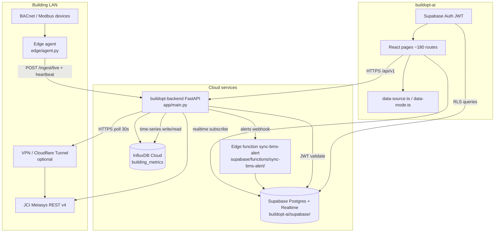

# System Architecture

**Last updated:** 2026-08-29  
**Target state** for BuildOpt pilot productionization (Dubai/GCC smart-building operations).

## Target data flow

## Component inventory

### Frontend (`buildopt-ai`)

| Component | Path | Role |
|-----------|------|------|
| App shell + lazy routes | `src/App.tsx` | Route loading, auth guard |
| Navigation | `src/lib/nav-config.ts` | 14 sidebar groups, ~180 paths |
| Auth + RBAC UI | `src/hooks/useAuth.tsx` | `get_user_roles` RPC, `roleConfig` |
| Data mode | `src/lib/data-mode.ts` | `VITE_DEMO_MODE` / live toggle |
| Data integrity helpers | `src/lib/data-source.ts` | `pickApiOrMockStrict`, empty states |
| Mock datasets | `src/lib/mock-data.ts`, `mock-data-advanced.ts` | HQ Tower demo (28,000 m²) |
| Live simulation | `src/hooks/useLiveSimulation.ts` | 14s KPI refresh (demo only) |
| BMS settings | `src/pages/BmsSettings.tsx` | Metasys credential UX |
| Supabase client | `src/integrations/supabase/client.ts` | **Do not edit** |
| Schema + RLS | `supabase/migrations/*.sql` | Canonical DB (17 migrations) |

### Backend (`buildopt-backend`)

| Component | Path | Role |
|-----------|------|------|
| FastAPI app | `app/main.py` | Routers, CORS, APScheduler lifespan |
| Config | `app/config.py` | `DEMO_MODE`, Influx, Supabase, JCI env |
| Module registry | `app/data/modules_registry.py` | Slug → category → API path |
| Data policy | `app/services/data_policy.py` | DEMO vs LIVE resolution |
| Live data | `app/services/live_data_service.py` | Poll, cache, empty live paths |
| Module payloads | `app/services/module_data_service.py` | Per-page API responses |
| Pipeline | `app/services/pipeline.py` | Poll, FDD, ML, tariff, prayer jobs |
| Metasys client | `app/services/jci_metasys.py` | REST login, read, write |
| BMS abstraction | `app/services/bms_connector.py` | `MetasysConnector` adapter |
| Ingest | `app/api/ingest.py` | Edge telemetry (`INGEST_API_KEY`) |
| Auth deps | `app/deps/auth.py`, `deps/guards.py` | JWT, module guards, tenant checks |
| Typed errors | `app/models/errors.py` | `NO_TELEMETRY`, `COMMAND_NOT_ALLOWED`, etc. |
| Write policy | `app/services/write_policy.py` | `READ_ONLY` default |
| FDD engine | `app/ml/fault_detector.py` | Rule evaluation |
| Health | `app/api/health.py` | Liveness, protocols, pipeline status |

### Edge / on-prem

| Component | Path | Role |
|-----------|------|------|
| Edge agent | `edge/agent.py` | BACnet/Modbus poll → Railway ingest |
| Point map | `edge/bacnet_points.json` | Logical key → device/object |
| Deploy guide | `edge/DEPLOY.md`, `edge/docker-compose.yml` | Docker profiles |

### Deployment

| Asset | Path |
|-------|------|
| Railway Docker | `Dockerfile.railway`, `railway.toml` |
| Env template | `railway.env.template`, `.env.example` |
| Verify script | `scripts/verify-production.ps1` |

## Scheduler jobs (Railway single instance)

| Job ID | Interval | Handler |
|--------|----------|---------|
| `poll_building_data` | `POLL_INTERVAL_SECONDS` (30s) | `pipeline.run_poll_cycle` |
| `fdd_engine` | 60s | `pipeline.run_fdd_cycle` |
| `ml_anomaly` | 5 min | `pipeline.run_ml_cycle` |
| `dewa_tariff` | 1 h | `pipeline.run_tariff_update` |
| `prayer_sync` | 24 h | `pipeline.run_prayer_sync` |
| `metasys_keepalive` | 10 min | `pipeline.run_metasys_keepalive` |

**Risk:** In-process APScheduler has no distributed lock — scale-out duplicates jobs.

## Production URLs (current)

| Service | URL |
|---------|-----|
| Frontend | `https://build-opt.site` |
| API | `https://buildopt-backend-production.up.railway.app` |
| API docs | `https://buildopt-backend-production.up.railway.app/docs` |

See `docs/integration-architecture.md` for adapter details.
