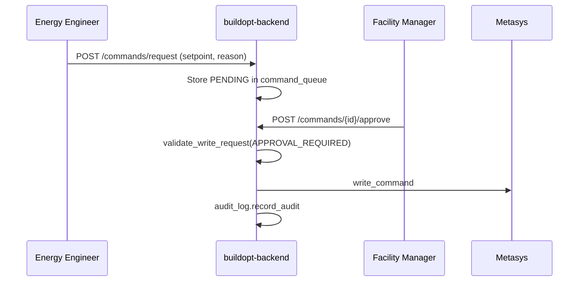

# Write-Back Safety

**Last updated:** 2026-08-29  
Control command policy — **READ_ONLY by default**, approval workflow planned.

## Policy summary

| Mode | Commands allowed | Status |
|------|------------------|--------|
| `READ_ONLY` | None (default) | **ENFORCED** in `write_policy.py` |
| `ADVISORY` | Recommendations only, no BMS write | PLANNED |
| `APPROVAL_REQUIRED` | Human approves each command | PLANNED |
| `AUTOMATIC` | MPC/autopilot (future) | PLANNED |

```python
# app/services/write_policy.py
DEFAULT_WRITE_MODE = WriteMode.READ_ONLY
```

## Enforcement layers

### 1. Write policy service

`app/services/write_policy.py` → `validate_write_request()`:

- Rejects all writes when `mode == READ_ONLY` → `ErrorCode.COMMAND_NOT_ALLOWED` (403)
- Rejects read-only accounts (`user.is_read_only`)
- Validates `requested_value` against min/max/max_step

### 2. BMS connector gate

`app/services/bms_connector.py`:

```python
async def write_point(self, point_id, value, *, allowed=False):
    if not allowed:
        return {"success": False, "reason": "write_disabled"}
```

### 3. Metasys API

`POST /api/v1/jci/objects/{object_id}/command` → `JCIMetasysClient.write_command()`

**Current gap:** Route does not yet call `validate_write_request()` on every path — wire before enabling pilot write-back.

### 4. Equipment setpoint route

`POST /api/v1/equipment/{id}/setpoint` — partial Metasys command when live; must respect write mode.

### 5. Building control stub

`POST /api/v1/buildings/{id}/control` — returns success stub; **disable** until policy wired.

## Frontend surfaces

| Page | Path | Risk |
|------|------|------|
| Setpoint write-back | `/setpoint-writeback` | UI may expose controls |
| Autopilot / optimization | `/autopilot`, `/optimization` | Must be advisory-only in pilot |
| JCI migration tools | `/jci-migration` | No accidental bulk writes |

Show `write_mode` metadata from API: `write_mode_metadata()` returns `{write_mode, write_enabled}`.

## Planned approval workflow



**Tables (planned):** `command_requests`, `command_approvals` in Supabase with RLS.

## Audit requirements

Every executed command must log via `app/services/audit_log.py`:

- Actor, tenant, object ID, old/new value, result, timestamp
- Future: immutable Supabase `audit_events` table

## Pilot rules

1. **Pilot default:** `READ_ONLY` — no exceptions without written change control.
2. Metasys API user: **read-only** credential until approval workflow ships.
3. Edge agent: ingest-only; no BACnet write from `edge/agent.py`.
4. `DEMO_MODE=true`: `write_command` returns success without network call — do not use for write-back testing.

## Enabling write-back (future procedure)

1. Customer signs operational risk acceptance.
2. Set building-level `write_mode` to `APPROVAL_REQUIRED` (config TBD).
3. Provision Metasys user with write scope (minimal object list).
4. Enable `validate_write_request` on all command routes.
5. Run manual test: small SAT offset within `max_step`.
6. Monitor `audit` logs for 7 days.

## Related

- `docs/security-model.md` — `require_write_access`
- `docs/metasys-integration.md` — command API
- `app/models/errors.py` — `COMMAND_NOT_ALLOWED`
